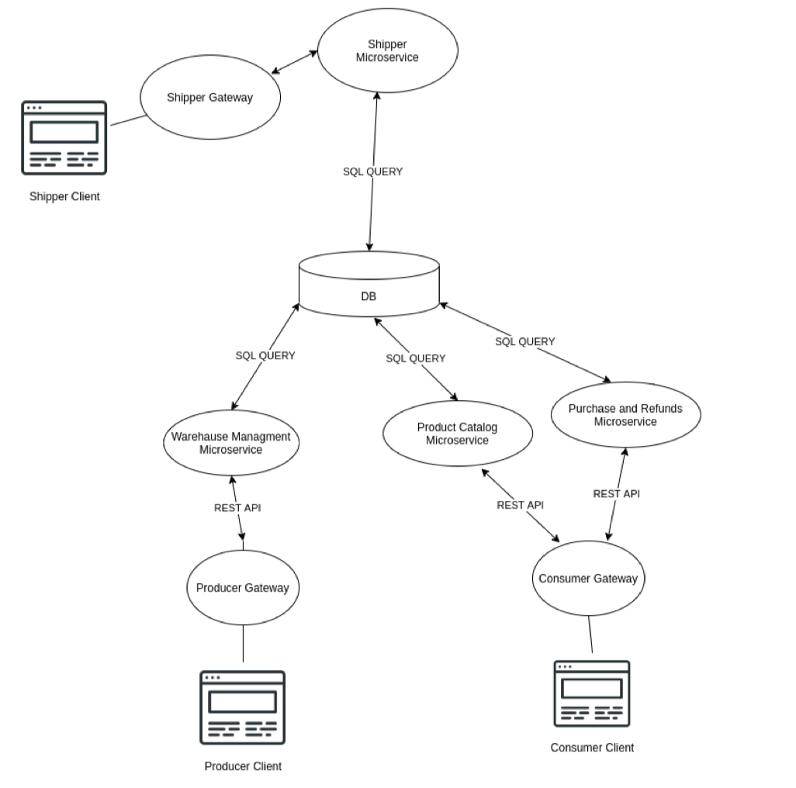

# CDC_app

## Team Members

The team is composed by:
- Carlo Carugno 1999815 
- Daniel Trippa 1837561
- Christian Tedesco 2025232

## Main Idea
CDC shop is a distributed system that handles the management, the payment and the shipment of products: in particular for materials that you can usually find in an hardware store.

## User Stories

As a customer:
1. I want to see my current shopping cart
2. I want to order the products for ascending/descending price
3. I want to retrieve a product by giving its name in a search bar
4. I want to check my order to see informations about my package
5. I want to pay for the current shopping cart
6. I want to register my account
7. I want to be able to login
8. I want to access to my profile
9. I want to logout from the profile
10. I want to access the about us page
11. I want to see the list of products
12. I want to see the details of a product

As a Merchant:
1. I want to insert/remove products
2. I want to change the price of a product
3. I want to order the products for ascending/descending price
4. I want to retrieve a product by giving its name in a search bar
5. I want to be able to login as an admin
6. I want to logout from the profile
7. I want to access to my profile
8. I want to access the about us page
9. I want to see the list of products
10. I want to see the details of a product

## Entities
There are basically three entities in the system:
- ***Merchant***: that handles the products, he can add, remove or modify products in the system.
- ***Customer***: can look for new products, save them if interested, and can also place orders or ask for a refund.
- ***Shipper***: that handles the shipments, he receives the product and takes care of the delivery. At the end he will confirm through his interface whether delivery has taken place or not.

## Components
- ***Warehouse service***: microservice that handles the warehouse of the shop.
- ***Product catalog service***: microservice for products management.
- ***Buy and refund service***: microservice dedicated to the sell and refund of any products.
- ***Shipping service***: microservice for the shipper to take care of shipments
- ***Orders middleware***: publish/subscribe topic based middleware to handle order requests.
- ***Database***: database to store data related to the system.
- ***Product Interface***: interface that allows the communication between the product and the product service
- ***Client Interface***: interface that allows the communication between the client and the “buy and refund” service
- ***Shipper Interface***: interface that allows the communication between the shipper and the shipping service
## Architecture

   

## DB Structure

***users***:
| ***id*** | name | email | phone | password |
| --- | --- | --- | --- | --- |

***cart***:
| ***id*** | order_id | product_id | quantity |
| --- | --- | --- | --- |

***orders***:
| ***id*** | date | customer_name | customer_email | customer_phone | total_price | paid | status |
| --- | -------- | ---------- | -------- | ----- | ----- | ----- | ----- |

***products***:
| ***id*** | name | description | category | price | stock | image_url |
| --- | -------- | ---------- | -------- | ----- | ----- | ----- |

***purchase_items***:
| ***id*** | purchase_id | prod_id | quantity | price |
| --- | -------- | ---------- | -------- | ----- |

***purchases:***
| ***id*** | date | supplier_id | total_price |
| --- | -------- | ---------- | -------- |

***suppliers***:
| ***id*** | name | address | email | phone |
| --- | ---- | --- | -------- | ----- |

## Warehouse api documentation

* GET /products

Returns all products filtered by the following optional parameters:

* limit
* orderby
* name

> Example: /products?name=screwdriver&orderby=DESC&limit=5
> Gets the first 5 "screwdriver" ordered by descending price

* POST /products
  
  Adds a products and returns it's newly created id

  Format of json body:
  {
    "name":"Tool",
    "description":"Test",
    "category":"Categoria 10",
    "price":30,
    "stock" : 30,
    "image_url" : "https://test"
 }

* GET /products/[id]

Gets the product with given id

* DELETE /products/[id]

Deletes product with given id
 
